## Hi, I'm Daniel.✌️

Sou estudante de Ciência da Computação, movido pela curiosidade e pela vontade constante de aprender , e adoraria compartilhar aqui minhas experiências. Gosto de explorar tecnologia, criar projetos práticos e evoluir um pouco a cada linha de código.

- 👾 Estudo front-end em flutter
- 🪄 Tucuruí-PA
- 👑 Back-end Dart

  
  

 
  
  
  
  
  
  
  
  
  

  
  ##
 

 
  
  
  
   

